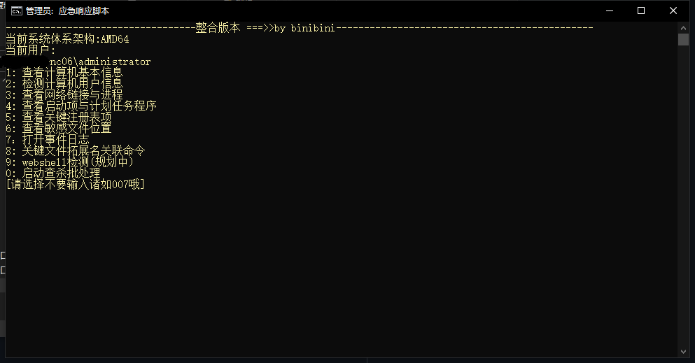
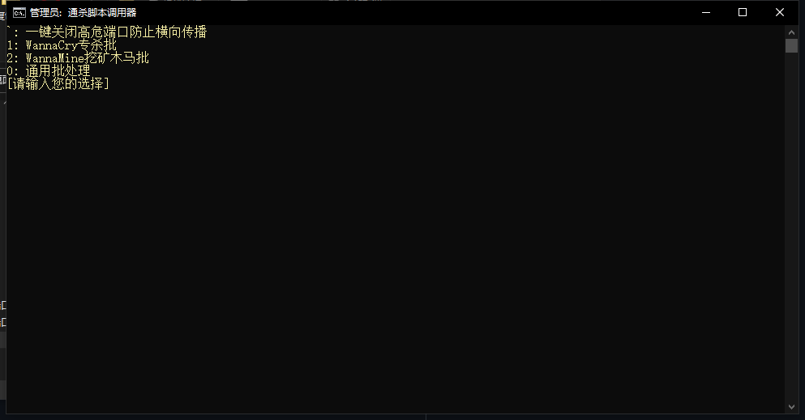
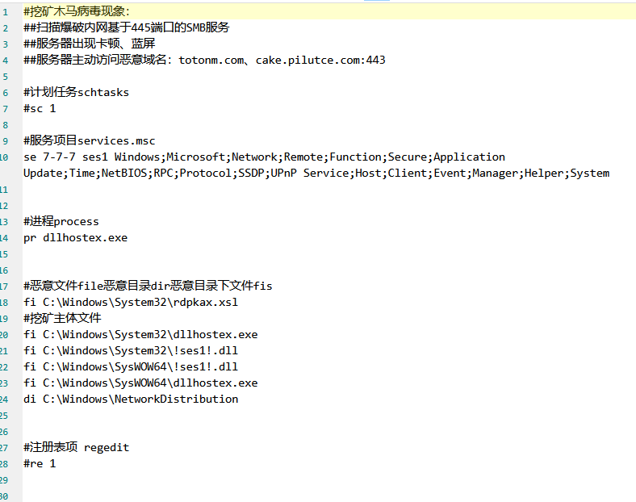

# 项目介绍

主功能：

1. 罗列计算机的基本信息 

* msinfo32、systeminfo等
  * todo
  
  * [ ] 添加插件:调用热门的**基线检查工具**(查看未打补丁等)

2. 检测计算机用户信息 

* 当前用户 net user 、net localgroup wmic useraccount get name,sid、lusrmgr.msc、HKLM\SAM\SAM\Domains\Account\Users\Names(需要注册表SAM权限调整)
  * todo
  * [x] 添加插件:启动**D盾**工具直接查看是否有克隆账号

3. 网络链接与进程 

* 任务管理器、进程服务列表、进程启动参数、网络链接列表
  * todo ps:现在已经有了一种能检测进程管理器来隐藏恶意进程的木马
  * [ ] 命令实现查看所有网络连接的进程名称与进程列表
  * [ ] 添加插件:添加**火绒剑**来方便查看

4. 查看启动项与计划任务

* msconfig、计划任务、计算机属性、ps显示计划任务、开始菜单自启动文件夹、bitsadmin自启动后门查看
  * todo
  * [x] 直接调用微软的autoruns来检查所有的自启动项

5. 注册表项

* HKEY_LOCAL_MACHINE\SOFTWARE\MICROSOFT\WINDOWS\CurrentVersion\Run、HKEY_LOCAL_MACHINE\SOFTWARE\MICROSOFT\WINDOWS\CurrentVersion\Policies\Explorer、HKEY_LOCAL_MACHINE\SOFTWARE\MICROSOFT\WINDOWS\CurrentVersion\Policies\Explorer\Run、HKEY_CURRENT_USER\SOFTWARE\MICROSOFT\WINDOWS\CurrentVersion\Run、HKEY_CURRENT_USER\SOFTWARE\MICROSOFT\WINDOWS\CurrentVersion\Policies\Explorer、HKEY_CURRENT_USER\SOFTWARE\MICROSOFT\WINDOWS\CurrentVersion\Policies\Explorer\Run、HKEY_CURRENT_USER\SOFTWARE\MICROSOFT\WINDOWS\CurrentVersion\RunOnce、HKEY_LOCAL_MACHINE\SOFTWARE\MICROSOFT\WINDOWS\CurrentVersion\RunOnce

6. 敏感文件排查

* %WINDIR%、%WINDIR%\tmp、%WINDIR%\system32\、%TEMP%、%LOCALAPPDATA%、%APPDATA%、%UserProfile%\Recent、%WINDIR%\Prefetch
  * todo
  * [ ] forfiles命令实现查找一定范围的文件

7. 日志分析

* %windir%\System32\winevt\Logs\、打开日志管理器eventvwr.msc
  * todo
  * [ ] 加入一些外部的日志分析工具 eg:
    * [x] logparser(微软)
    * [ ] event log explorer (可视化分析工具)
    * [ ] 观星平台(一键上传分析)

8. 扩展名关联项后门查看

* assoc ; ftype txtfile & ftype exefile

9. webshell检测 todo
   1. 基于流量
   2. 基于文件
   3. 基于日志

0. [查杀批处理](#1)

<a name="1">介绍</a>

可定义自己的规则来进行自动化的

1. 结束计划任务
2. 终止服务项(一些EDR仍然没有很好的结束服务项造成权限维持)
3. 杀死恶意进程
4. 删除恶意文件;恶意目录;恶意目录下的文件
5. 删除注册表项(有时在成功结束上述项时注册表就自行删除了)

现已定制的规则如下

ps:已实验的都是亲自拿虚拟机在本地用病毒样本运行过的

* 勒索
  * wannacry(已实验)
* 挖矿
  * wannamine
  * wannamine2.0
  * wannamine3.0
  * wannamine4.0(已实验)
* 其他 远控僵尸网络木马等
  * 3601(僵尸网络木马lpk.dll劫持利用)

[`: 一键关闭高危端口横向传播](#2)

0：在添加自己的规则后需要按下0然后输入自己的规则的文件名称 如wannamine4.0

自定义规则填写介绍

> 结束计划任务1(有注释不执行)
>
> 结束服务项目为3段组合项目结合的服务(eg可以拼接组合成:WindowsUpdateService、NetworkTimeSSDP)并以ses1为别名可被别处调用
>
> 杀死dllhostex进程
>
> 删除C:\Windows\System32\rdpkax.xsl、C:\Windows\System32\dllhostex.exe 、C:\Windows\System32\!ses1!.dll、C:\Windows\SysWOW64\!ses1!.dll、C:\Windows\SysWOW64\dllhostex.exe恶意文件 删除C:\Windows\NetworkDistribution恶意目录
>
> 删除注册表 1(有注释不执行)

<a name=2>一键关闭高危端口批处理</a>

1. 禁止135 137 138 139 445(tcp) 137 138(UDP)端口 默认使用IPSEC安全策略 选择可以自行切换到使用wf.msc高级安全防火墙策略来完成封禁
2. 业务需要或处理完成后删除封禁策略从而打开封禁的端口
3. 将安全策略文件导出到本地以便批量在其他电脑导入
4. 导入3导出的安全策略

## 项目目录介绍

路径|说明
---|---
arichive2tools:|存放一些指定的压缩工具的目录解压后默认会被释放到tools目录
tools:|解压后的工具存放的位置
**main:**|------------------------主程序目录-------------------------------
"$.debug" 													|调试目录
".his"|					 										历史文件夹
"evtx"		| logparser分析批处理脚本存放 
"log"		|												 	批处理运行时的所有日志记录
"vir"			|											 	自定义查杀规则存放目录
"auto_temp.cmd"			|					   	可直接自动运行某种类型的木马查杀批处理	
"应急响应1.0.cmd"	|								主功能批处理脚本
"killvir1.0.cmd"		|							   	查杀功能批处理脚本
"choosetools.cmd"		|							   	选择工具批处理脚本
"隔离-一键关闭高危端口choice版.bat"	|使用choice来实现选择式关闭高危端口的批处理
"隔离-一键关闭高危端口set版-1.1.bat"    |处理高危端口的批处理
"choice.exe"		|										为了兼容win2003的选择的命令行默认程序
"forfiles.exe"				|						   	为了兼容win2003的遍历目录的命令行默认程序
"7zG.exe"				|						   	解压程序
"7z.dll"				|						   	解压程序依赖的必要动态库文件
"wmicprocess.txt"					|		     	wmic process的所有列字段	

